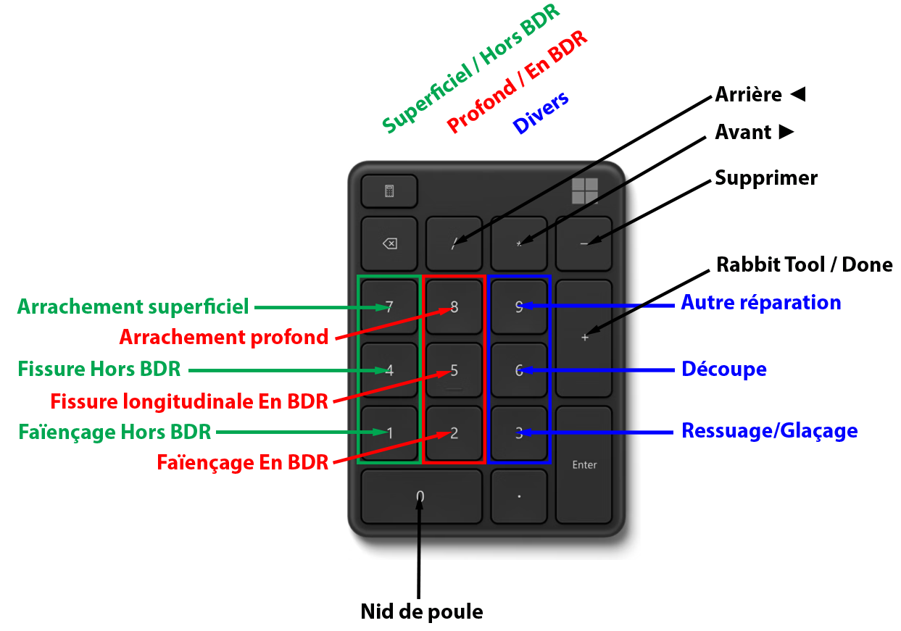

# label-shortcuts

Plugin CVAT UI qui assigne un raccourci clavier à chaque label d'un projet,
selon son rang dans l'ordre alphabétique, avec une correspondance
touche/rang entièrement personnalisable et une persistance stable par
projet.

## Ce que ça fait

1. Au chargement d'un job, récupère tous les labels du **projet** (pas
   seulement ceux du job) via `core.projects.get({ id: projectId })`.
2. Ne garde que les labels dont le type est compatible avec un **masque**
   (voir `ELIGIBLE_LABEL_TYPES` ci-dessous) — les labels de type Tag (ou tout
   autre type incompatible) ne consomment jamais un des emplacements de
   raccourci.
3. Trie ces labels alphabétiquement, puis mémorise cet ordre dans le
   `localStorage` du navigateur, par ID de projet — les rangs déjà attribués
   ne bougent plus jamais, même si l'ordre alphabétique change (nouveau
   label ajouté, etc.) : les nouveaux labels sont simplement ajoutés à la
   suite.
4. Applique `DEFAULT_SLOT_RANKS`, ou la surcharge personnelle de
   l'utilisateur connecté si elle existe (voir ci-dessous), pour décider quel
   rang alimente quel raccourci clavier.
5. Au clavier, reproduit le comportement natif de CVAT (relabelliser l'objet
   sélectionné si son type est compatible, ou mémoriser le label par défaut
   du prochain objet dessiné sinon).
6. En plus des chiffres, prend aussi en charge 4 touches fixes du pavé
   numérique pour le dessin, la suppression et la navigation — voir
   [Touches fixes](#touches-fixes-non-configurables--dessin-suppression-navigation)
   ci-dessous.

Ces raccourcis restent actifs en changeant de job dans le même projet (rien
n'est recalculé), et sont retrouvés automatiquement en revenant plus tard sur
un projet déjà visité (relu depuis le `localStorage`).

## Exemple : pavé numérique entièrement personnalisé



Cet exemple (spécifique à un projet d'inspection de chaussée) combine les 4
touches fixes ci-dessous (`/` `*` `-` `+`) avec une configuration personnelle
de `DEFAULT_SLOT_RANKS`/`cvatLabelShortcuts.setSlotRanks(...)` pour les
chiffres 1 à 9 et 0. Les libellés de labels et le regroupement par couleur
sont propres à ce projet — à adapter selon les tiens.

## Configuration

Tout se règle en tête de fichier (`src/ts/index.tsx`) :

### `SHORTCUTS` — quelle touche physique pour quel emplacement

```ts
const SHORTCUTS: { codes: string[]; alt?: boolean; shift?: boolean; ctrl?: boolean }[] = [
    { codes: ['Digit1', 'Numpad1'] },
    { codes: ['Digit2', 'Numpad2'] },
    // ...
];
```

- L'entrée d'index 0 est le raccourci du 1er label, l'index 1 du 2e, etc.
- Le nombre d'entrées plafonne aussi le nombre de labels qui ont un
  raccourci — ajouter/retirer des lignes pour changer ça.
- `codes` liste les valeurs `KeyboardEvent.code` (touche **physique**,
  indépendante de la disposition clavier AZERTY/QWERTY) qui déclenchent ce
  même rang - actuellement la rangée de chiffres du haut et le pavé
  numérique fonctionnent tous les deux pour le même chiffre.
- `alt`/`shift`/`ctrl` : modificateurs requis (actuellement aucun - touche
  seule).
- Pour trouver le code d'une touche physique précise, dans la console du
  navigateur :
  ```js
  document.addEventListener('keydown', (e) => console.log(e.code), { once: true })
  ```

Historique des combinaisons testées et rejetées (pour ne pas les re-tester) :
voir le commentaire en tête de `index.tsx`. En résumé : `Alt+chiffre` est
intercepté par certains gestionnaires de fenêtres Linux (changement de
bureau virtuel) ; `Ctrl+chiffre` seul est réservé par les navigateurs pour
changer d'onglet ; `Ctrl+Shift+chiffre` entre en conflit avec le raccourci
natif CVAT "Switch label" (`labels-list.tsx`, non modifié par ce plugin) ;
`Ctrl+Alt+Shift+chiffre` fonctionne mais a été jugé trop lourd à taper. Le
choix final (chiffre seul, sans modificateur) n'a aucun conflit connu, mais
signifie qu'une frappe est interceptée dès que le focus n'est pas dans un
champ de texte reconnu (voir `isEditableTarget`).

### `ELIGIBLE_LABEL_TYPES` — quels types de labels peuvent avoir un raccourci

```ts
const ELIGIBLE_LABEL_TYPES = new Set<LabelType>([LabelType.MASK, LabelType.ANY]);
```

Seuls les labels dont le type est dans cet ensemble sont candidats à un
raccourci (les autres, ex. les Tags, sont ignorés dès le calcul de l'ordre
alphabétique). À adapter si les raccourcis doivent cibler un autre type de
forme (polygone, rectangle...).

### `DEFAULT_SLOT_RANKS` — quel rang alphabétique va dans quel raccourci

```ts
const DEFAULT_SLOT_RANKS: number[] = [1, 2, 3, 4, 5, 6, 13, 12, 10, 11];
```

- 1-indexé. `DEFAULT_SLOT_RANKS[0]` = quel rang alimente le 1er raccourci de
  `SHORTCUTS`, etc. Doit avoir exactement `SHORTCUTS.length` entrées.
- Par défaut, séquentiel (`[1, 2, ..., 10]`), mais les rangs peuvent être
  sautés, répétés ou réordonnés librement : ex. `[1, 2, 3, 4, 5, 6, 11, 12, 13, 14]`
  fait cibler les rangs 11 à 14 par les 4 derniers raccourcis, en sautant les
  rangs 7 à 9 (qui n'ont alors aucun raccourci).
- Si un rang demandé n'existe pas (projet avec moins de labels éligibles que
  prévu), un avertissement est affiché en console et ce raccourci reste
  inactif.
- C'est la valeur utilisée pour tout utilisateur qui n'a pas défini de
  configuration personnelle (voir juste en dessous).

### Configuration personnelle par utilisateur, depuis la console (sans toucher au code)

N'importe quel utilisateur CVAT connecté peut définir **sa propre**
correspondance rang → raccourci, indépendamment de `DEFAULT_SLOT_RANKS`,
directement depuis la console de son navigateur, sans éditer ce fichier ni
rebuilder :

1. Ouvre un job du projet à personnaliser, pour que le plugin ait déjà chargé
   la liste des labels éligibles.
2. Ouvre les DevTools du navigateur (F12 ou Ctrl+Shift+I) et va dans l'onglet
   **Console**.
3. Regarde le mapping actuel (affiché automatiquement au chargement du job,
   ou à la demande) :
   ```js
   cvatLabelShortcuts.getSlotRanks()
   ```
   Ça retourne un tableau de rangs, ex. `[1, 2, 3, 4, 5, 6, 13, 12, 10, 11]`
   — l'entrée à l'index 0 est ce qui alimente le raccourci `1`, l'index 1 le
   raccourci `2`, etc. (voir le log `[label-shortcuts] Project ...` pour
   savoir à quel **nom de label** correspond chaque rang).
4. Définis ta propre liste de rangs (même longueur que `SHORTCUTS`, donc 10
   valeurs par défaut) :
   ```js
   cvatLabelShortcuts.setSlotRanks([1, 2, 3, 4, 5, 6, 11, 12, 13, 14])
   ```
   Ça s'applique **immédiatement** (pas besoin de recharger la page) et
   s'affiche dans la console pour confirmation.
5. Pour revenir à la configuration par défaut à tout moment :
   ```js
   cvatLabelShortcuts.resetSlotRanks()
   ```

Détails à connaître :
- Si un rang demandé n'existe pas (project a moins de labels éligibles que
  prévu), un avertissement s'affiche en console et ce raccourci reste inactif
  — comme pour `DEFAULT_SLOT_RANKS`.
- Stocké dans le `localStorage` du navigateur, sous une clé qui inclut
  l'ID de l'utilisateur CVAT connecté (`pluginLabelShortcutsSlotRanks:<id>`).
  C'est donc une préférence **par compte ET par navigateur/machine** : elle
  ne suit pas l'utilisateur s'il se connecte depuis un autre poste, il devra
  la redéfinir une fois là-bas.
- Cette personnalisation console ne couvre que les **chiffres** (les rangs de
  labels). Les 4 touches fixes (`/` `*` `-` `+`, voir ci-dessous) ne sont pas
  configurables de cette façon — leur comportement est câblé dans le code du
  plugin.

## Touches fixes (non configurables) : dessin, suppression, navigation

En plus des chiffres, le plugin prend en charge 4 touches supplémentaires du
pavé numérique, câblées en dur dans `index.tsx` (pas de config `SHORTCUTS`
pour celles-ci) :

| Touche | Équivalent natif | Effet |
|---|---|---|
| `Numpad +` | `n` | Démarre/répète le dessin (mode standard), ou ouvre l'outil **Rabbit** en mode NCP (voir plus bas) |
| `Numpad -` | `Delete` | Supprime l'objet sélectionné (`Shift+Numpad -` force la suppression d'un objet verrouillé) |
| `Numpad /` | `d` | Frame précédente |
| `Numpad *` | `f` | Frame suivante |

Pourquoi ces 4 touches spécifiquement, et pourquoi en dur plutôt que via
`SHORTCUTS`/Mousetrap :
- `Numpad +` : le raccourci natif "Draw mode" (`n`) ne peut pas être étendu à
  `+` via Settings → Shortcuts à cause d'un bug de la bibliothèque Mousetrap
  (`_SHIFT_MAP` réinterprète `+` comme `Shift+Egal`, ce qui ne correspond
  jamais à la touche `+` du pavé numérique). Voir le commentaire au-dessus de
  `triggerDrawMode` dans `index.tsx` pour le détail complet.
- `Numpad +` respecte aussi le mode actif : en mode "Rabbit"/NCP
  (`state.settings.workspace.showPrivateAttributes === false`), il ouvre le
  sélecteur Rabbit (`ncp:open-rabbit`) plutôt que la palette de dessin
  standard — reproduisant `ncp-controls-side-bar.tsx` au lieu de
  `controls-side-bar.tsx`.
- `Numpad -`, `Numpad /` et `Numpad *` fonctionneraient en théorie via
  Settings → Shortcuts (pas de bug Mousetrap pour ces touches-là), mais `-`
  et `/` sont déjà utilisés par défaut ailleurs (`-` par "Move to
  background", `/` par "Switch occluded") : le raccourci natif intercepterait
  et stopperait l'événement avant qu'il n'atteigne un plugin classique. Ce
  plugin écoute donc en **phase de capture** (avant Mousetrap) et stoppe
  lui-même la propagation, pour prendre la main de façon fiable sur ces 4
  touches.
- `Numpad /` et `Numpad *` respectent le mode de navigation actif
  (Regular/Filtered/Chapter/Empty) exactement comme `d`/`f` — donc si le
  plugin `skip-auto-validated` a activé la navigation filtrée, ces deux
  touches sautent aussi les frames déjà validées.

## Vérifier le résultat

Après chargement d'un job, la console navigateur affiche un résumé du
mapping actuel :

```
[label-shortcuts] Project 1:  1 -> "Crack", 2 -> "Bleeding", ...
```

## Limites connues

- Utilise un simple listener `keydown` global (`window.addEventListener`),
  pas le système `registerComponentShortcuts`/Mousetrap de CVAT — ces
  raccourcis n'apparaissent donc **pas** dans la fenêtre d'aide Settings →
  Shortcuts.
- Aucune modification du cœur CVAT n'est nécessaire ni faite : le raccourci
  natif "Switch label" (`Ctrl+N`/`Ctrl+Shift+N`, ordre de création) reste
  actif tel quel. Si `SHORTCUTS` est un jour reconfiguré pour réutiliser ces
  mêmes séquences, un conflit réapparaît (comportement imprévisible, lequel
  des deux gagne dépend de l'ordre d'enregistrement Mousetrap) - c'est pour
  ça que la config actuelle évite volontairement Ctrl et Ctrl+Shift.
- Avec le schéma "touche seule" actuel, une frappe est interceptée par ce
  plugin dès que le focus n'est pas reconnu comme un champ de texte
  (`<input>`/`<textarea>`/`contentEditable` - voir `isEditableTarget`), ce
  qui ne couvre pas forcément tous les widgets custom.

## Build & déploiement

Le plugin est chargé uniquement s'il est listé dans la variable d'env
`CLIENT_PLUGINS` au moment du build de `cvat-ui`. Il n'a aucun effet sur un
build qui ne le liste pas.

Depuis la racine du dépôt :

```bash
docker compose -f docker-compose.yml -f docker-compose.dev.yml build cvat_ui \
  --build-arg CLIENT_PLUGINS=plugins/label-shortcuts
docker compose -f docker-compose.yml -f docker-compose.dev.yml up -d cvat_ui
```

Pour combiner avec le plugin `skip-auto-validated` (les deux tournent
ensemble en usage réel) :

```bash
docker compose -f docker-compose.yml -f docker-compose.dev.yml build cvat_ui \
  --build-arg CLIENT_PLUGINS=plugins/skip-auto-validated:plugins/label-shortcuts
docker compose -f docker-compose.yml -f docker-compose.dev.yml up -d cvat_ui
```

Ces deux commandes sont nécessaires à **chaque** modification du fichier
`index.tsx` (y compris juste changer `DEFAULT_SLOT_RANKS` ou `SHORTCUTS`) —
éditer la source seule ne suffit pas, le conteneur `cvat_ui` sert un bundle
déjà compilé tant qu'il n'est pas reconstruit et redémarré. La configuration
personnelle par utilisateur (`cvatLabelShortcuts.setSlotRanks(...)`) est la
seule exception : elle prend effet immédiatement, sans rebuild.

Après déploiement, recharger la page CVAT avec un rechargement forcé
(Ctrl+Shift+R) pour être sûr de charger le nouveau bundle.
